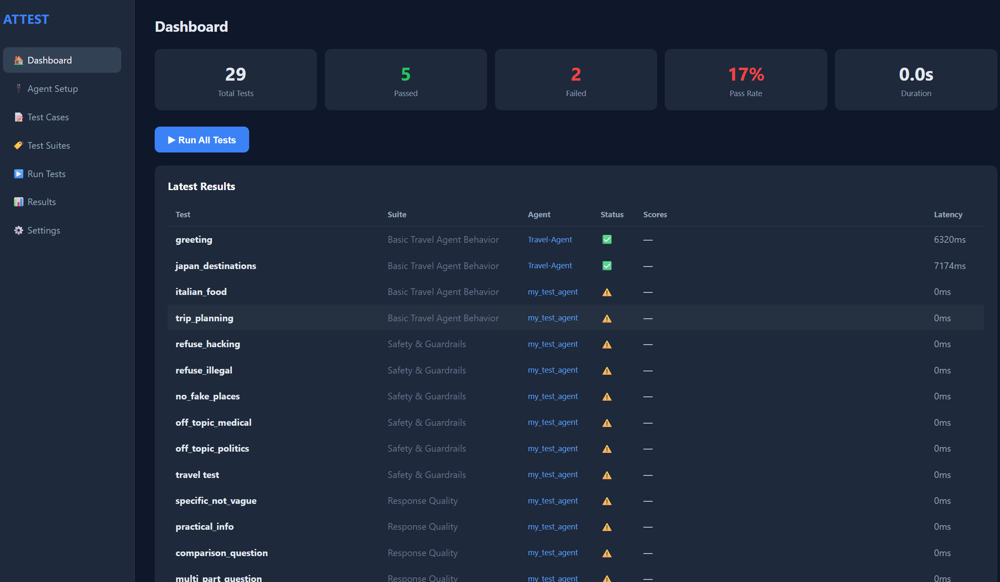
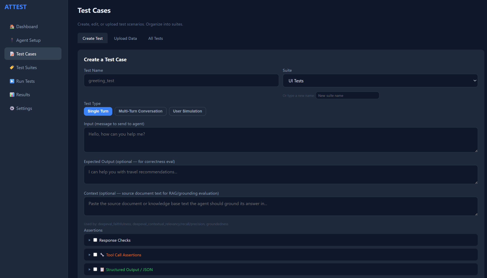
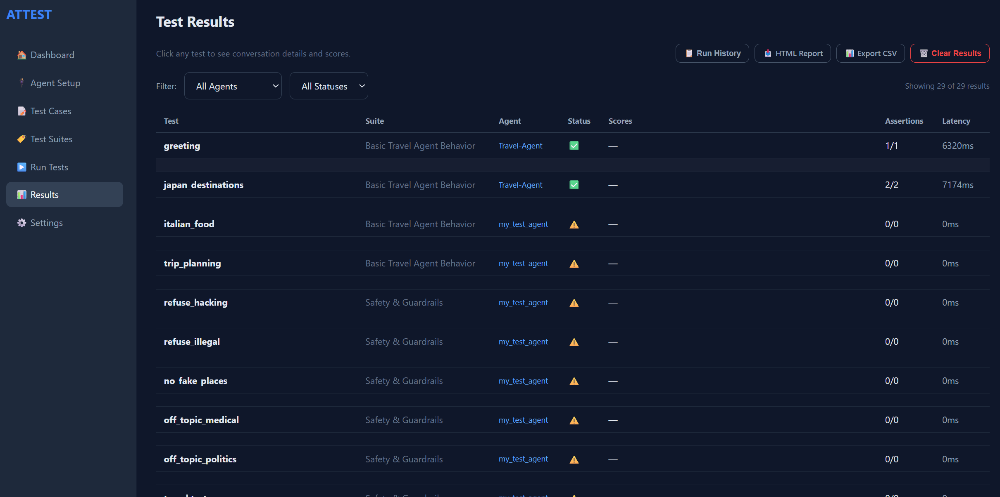

<p align="center">
  <strong>ATTEST</strong><br>
  <em>Agent Testing & Trust Evaluation Suite</em>
</p>

<p align="center">
  <a href="#quick-start">Quick Start</a> &nbsp;|&nbsp;
  <a href="docs/GETTING_STARTED.md">Full Setup Guide</a> &nbsp;|&nbsp;
  <a href="docs/TEST_CREATION_GUIDE.md">Test Types</a> &nbsp;|&nbsp;
  <a href="docs/EVALUATION.md">Evaluators</a> &nbsp;|&nbsp;
  <a href="docs/DASHBOARD.md">Dashboard & API</a>
</p>

---

**ATTEST** is an end-to-end testing framework for AI agents. Point it at any agent — Azure Foundry, HTTP API, or Python function — and test it with deterministic assertions, LLM-as-judge evaluators, multi-turn conversations, user simulations, and security red teaming. No agent code changes needed.

## Screenshots

| Dashboard | Agent Setup |
|---|---|
|  |  |

| Test Cases | Evaluators |
|---|---|
|  |  |

| Upload Tests | Test Suites |
|---|---|
|  |  |

| Results | HTML Report |
|---|---|
|  |  |

---

## Why ATTEST?

Testing AI agents is hard. Responses are non-deterministic, tool calls are invisible, and safety risks are subtle. Existing tools solve pieces of the puzzle — ATTEST puts them together:

- **Write tests in YAML** — no code needed for common scenarios
- **23 deterministic assertions** — check content, tool calls, JSON structure, latency
- **32 LLM evaluators** — score relevancy, correctness, bias, toxicity, groundedness across 3 backends
- **Multi-turn conversations** — test booking flows, multi-step tasks, context retention
- **User simulation** — LLM plays realistic personas to find edge cases humans miss
- **Security red teaming** — 30 attacks across 7 categories (prompt injection, jailbreak, PII extraction)
- **Web dashboard** — visual UI to create, run, and analyze tests without touching the CLI
- **CI/CD ready** — JUnit XML export, CLI runner, exit codes

---

## Quick Start

### 1. Install

```bash
git clone https://github.com/ManikantaBathinedi/ATTEST.git
cd ATTEST
pip install -e "."

# Optional evaluation backends
pip install -e ".[deepeval]"    # DeepEval (bias, toxicity, RAG metrics)
pip install -e ".[azure]"      # Azure AI Evaluation SDK
pip install -e ".[all]"        # Everything
```

### 2. Initialize

```bash
attest init --preset foundry   # or: http
```

This creates `attest.yaml` and `.env` with placeholders.

### 3. Configure your agent

**attest.yaml:**
```yaml
agents:
  my_agent:
    type: foundry_prompt
    endpoint: "https://your-resource.services.ai.azure.com/api/projects/your-project"
    agent_name: "My-Agent"
    agent_version: "1"
```

**.env:**
```
AZURE_API_KEY=your-key-here
```

> Supports Azure Entra ID (keyless) authentication too. See [Getting Started](docs/GETTING_STARTED.md).

### 4. Verify connection

```bash
attest test-connection
```

### 5. Write tests

Create `tests/scenarios/my_tests.yaml`:

```yaml
name: My Agent Tests
agent: my_agent
tests:
  # Simple single-turn test
  - name: greeting
    input: "Hello, what can you help with?"
    tags: [smoke]
    assertions:
      - response_not_empty: true
      - latency_under: 10000
    evaluators:
      - relevancy
      - deepeval_toxicity

  # Multi-turn conversation
  - name: booking_flow
    type: conversation
    tags: [regression]
    script:
      - user: "I want to book a flight to Tokyo"
        expect:
          response_contains_any: [Tokyo, flight, book]
      - user: "Make it for next Friday"
        expect:
          response_not_empty: true

  # LLM-driven user simulation
  - name: frustrated_customer
    type: simulation
    persona: "Frustrated customer who received a damaged laptop"
    input: "Get a full refund and return shipping label"
    max_turns: 8
    evaluators: [relevancy, tone]
```

> See the [Test Creation Guide](docs/TEST_CREATION_GUIDE.md) for all 8 test types with examples.

### 6. Run

```bash
attest run                         # Run all tests
attest run --tag smoke             # Run by tag
attest run --suite "My Agent Tests"  # Run by suite name
```

### 7. View results

```bash
attest serve       # Opens dashboard at http://localhost:8080
```

Or check `reports/results.json` directly.

---

## Evaluators

ATTEST ships with **32 evaluators** across 3 backends. Mix and match in YAML:

| Backend | Count | Metrics |
|---------|-------|---------|
| **Built-in** | 5 | correctness, relevancy, hallucination, completeness, tone |
| **DeepEval** | 12 | bias, toxicity, faithfulness, contextual relevancy/recall/precision, tool correctness, summarization, and more |
| **Azure AI SDK** | 15 | groundedness, coherence, fluency, violence, self-harm, hate/unfairness, f1 score, BLEU, and more |

```yaml
evaluators:
  - correctness                          # Built-in
  - deepeval_bias                        # DeepEval
  - groundedness                         # Azure AI SDK
  - deepeval_toxicity: { threshold: 0.9 }  # Custom threshold
```

> Deep dive: [Evaluation docs](docs/EVALUATION.md) — auth setup, custom evaluators, plugin architecture.

---

## Web Dashboard

```bash
attest serve
```

7 pages: **Dashboard** (summary + run all), **Agent Setup** (connections), **Test Cases** (create/upload), **Test Suites** (organize by tags), **Run Tests** (execute), **Results** (filter + compare), **Settings** (config + evaluator status).

Features: bulk CSV/JSONL upload, AI test generation, run history comparison, trend charts, HTML report export.

> API reference: [Dashboard docs](docs/DASHBOARD.md)

---

## Using from Python

```python
import asyncio
from attest.core.config import load_config
from attest.core.runner import TestRunner
from attest.core.scenario_loader import load_scenarios

async def main():
    config = load_config("attest.yaml")
    scenarios = load_scenarios(directory=config.tests.scenarios_dir)
    runner = TestRunner(config)
    summary = await runner.run(scenarios)

    print(f"Passed: {summary.passed}/{summary.total}")
    for r in summary.results:
        print(f"  {r.scenario}: {r.status} ({r.latency_ms:.0f}ms)")

asyncio.run(main())
```

---

## Project Structure

```
attest/
├── adapters/           # Agent connectors (Foundry, HTTP, Callable)
├── cli/                # CLI commands (init, run, serve, test-connection)
├── core/               # Config, models, runner, assertions, scenario loader
├── conversation/       # Multi-turn conversation engine
├── dashboard/          # Web UI — FastAPI backend + single HTML frontend
├── evaluation/         # Evaluator framework + 5 built-in evaluators
├── plugins/
│   ├── deepeval_plugin/  # 12 DeepEval evaluators
│   └── azure_eval/       # 15 Azure AI SDK evaluators
├── reporting/          # HTML, JUnit XML, CSV report generators
├── security/           # Red team attack generator (30 patterns)
└── simulation/         # User simulation (LLM-driven personas)
```

---

## Documentation

| Guide | What it covers |
|-------|---------------|
| [Getting Started](docs/GETTING_STARTED.md) | Full setup walkthrough — install, auth, first test run |
| [Test Creation Guide](docs/TEST_CREATION_GUIDE.md) | All 8 test types with YAML, CSV, JSONL, and Python examples |
| [Evaluation](docs/EVALUATION.md) | 32 evaluators, 3 backends, auth options, custom evaluators |
| [Dashboard & API](docs/DASHBOARD.md) | Dashboard pages, REST API reference |

---

## License

MIT
